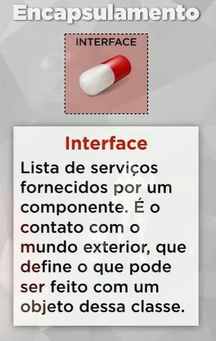

# ENCAPSULAMENTO

 <br>
 <br>
 <br>
 <br>
 <br>
 <br>
 <br>
 <br>
 <br>

O encapsulamento é um dos conceitos fundamentais da programação orientada a objetos (POO) e refere-se à prática de ocultar os detalhes internos de uma classe, permitindo o acesso controlado aos atributos e métodos dessa classe. O encapsulamento é alcançado por meio da definição de visibilidade de membros de classe (atributos e métodos) como `public`, `protected` ou `private`. Vou explicar como esses níveis de visibilidade afetam o encapsulamento em PHP:

1. **Public**: Membros com visibilidade pública são acessíveis de qualquer lugar, tanto de dentro quanto de fora da classe. Isso significa que qualquer código externo pode acessar e modificar esses membros diretamente. O encapsulamento não é aplicado a membros públicos.

```php
class MinhaClasse {
    public $atributoPublico;
    
    public function metodoPublico() {
        // ...
    }
}
```

2. **Protected**: Membros com visibilidade protegida só podem ser acessados de dentro da classe em que são definidos ou em suas subclasses. Isso significa que esses membros são ocultos de código externo. No entanto, eles podem ser acessados e modificados a partir de métodos da classe ou de suas subclasses.

```php
class MinhaClasse {
    protected $atributoProtegido;
    
    protected function metodoProtegido() {
        // ...
    }
}
```

3. **Private**: Membros com visibilidade privada só podem ser acessados de dentro da classe em que são definidos. Eles são totalmente ocultos de código externo, incluindo subclasses. O encapsulamento é mais rigorosamente aplicado a membros privados.

```php
class MinhaClasse {
    private $atributoPrivado;
    
    private function metodoPrivado() {
        // ...
    }
}
```

O encapsulamento é uma prática importante para manter a integridade e a segurança do código. Ele permite que você restrinja o acesso direto a atributos e métodos, o que ajuda a evitar alterações indesejadas e erros inesperados. A maioria das classes define seus atributos como privados ou protegidos e fornece métodos públicos (getters e setters) para acessar e modificar esses atributos de forma controlada. Isso é conhecido como "encapsulamento de dados".

Aqui está um exemplo de como usar encapsulamento em uma classe:

```php
class Pessoa {
    private $nome;
    
    public function setNome($nome) {
        // Validar e configurar o atributo nome
        $this->nome = $nome;
    }
    
    public function getNome() {
        return $this->nome;
    }
}

$joao = new Pessoa();
$joao->setNome("João"); // Usando o setter
echo $joao->getNome(); // Usando o getter
```

Neste exemplo, o atributo `nome` é privado, e os métodos `setNome` e `getNome` são usados para acessá-lo de maneira controlada. O encapsulamento ajuda a manter a consistência dos dados e a garantir que a validação e a lógica associadas aos atributos sejam aplicadas corretamente.